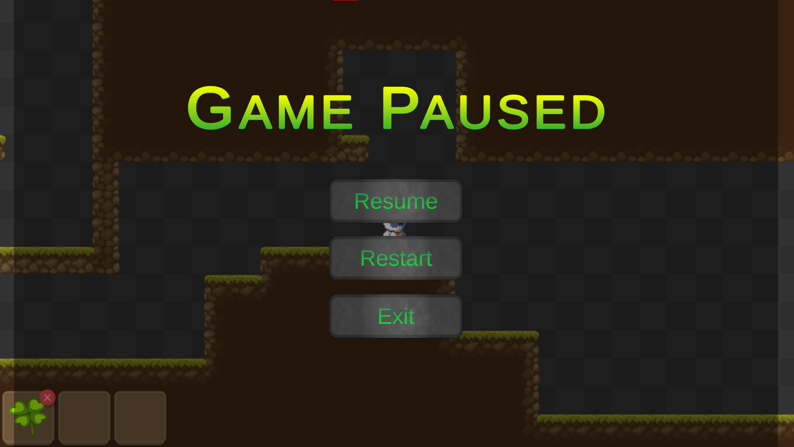
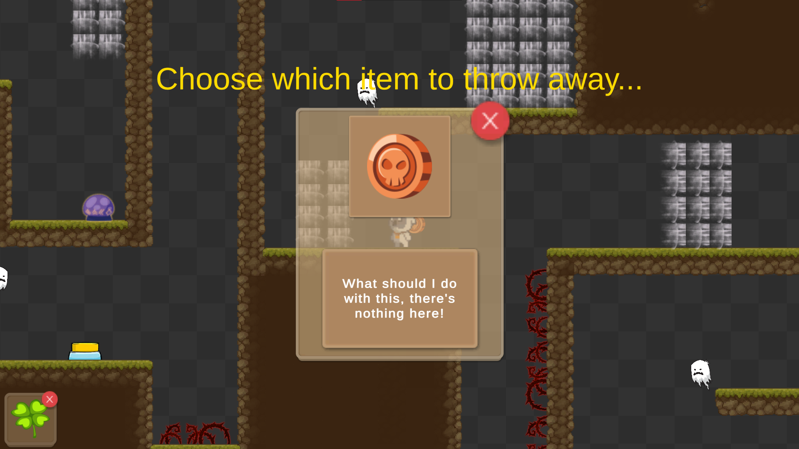
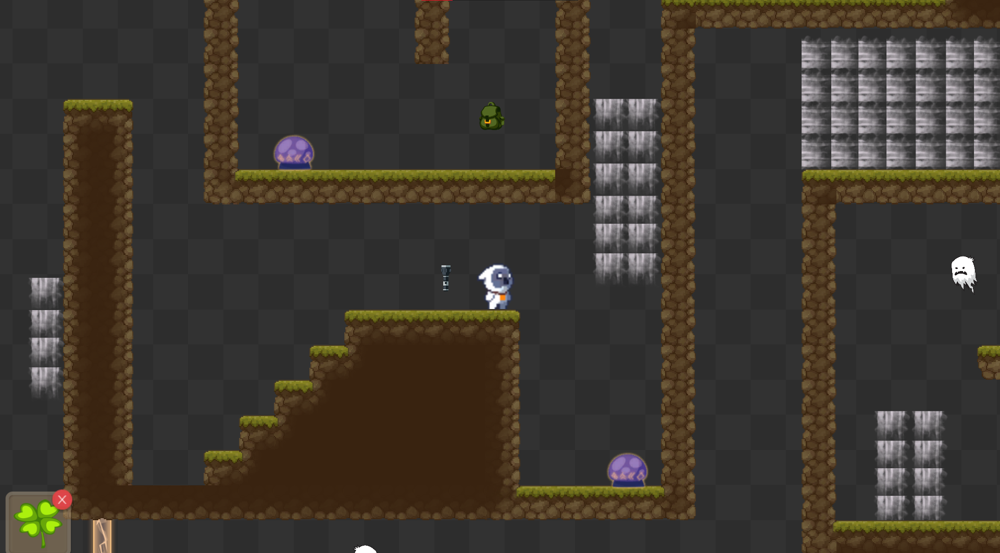
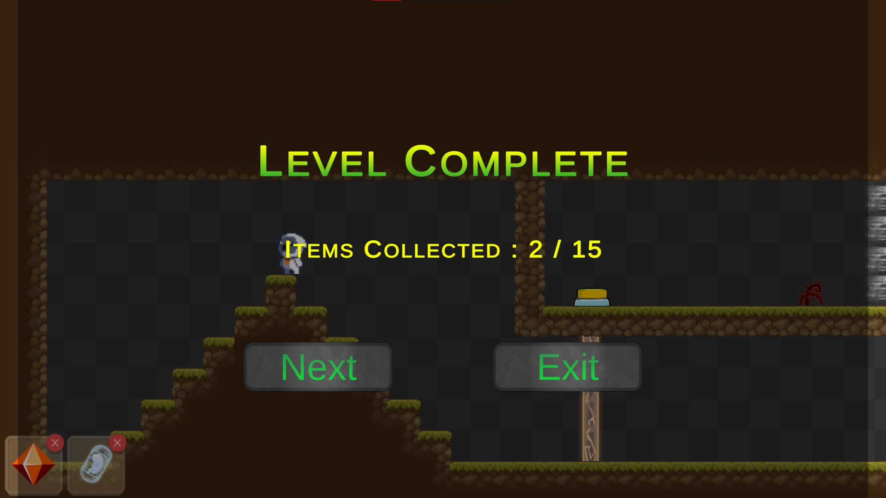

# The Last Luggage
A 2D puzzle platformer game, in which you have to collect items as many as possible while maintaining your inventory.

# Instructions for the game
- Player movement using WASD keys.
- Throw teleporter using E key.
- Destroy teleporter using Q key.

# Features of the game
- Used Singleton Pattern for inventory.
- Used Object Pooling for inventory slots.
- Used Observer Pattern for inventory.
- Used Scriptable Objects for storing items.
- Fully Customizable items and inventory.
- Made an Inventory System.

